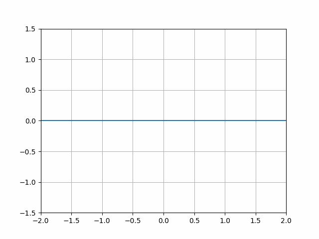
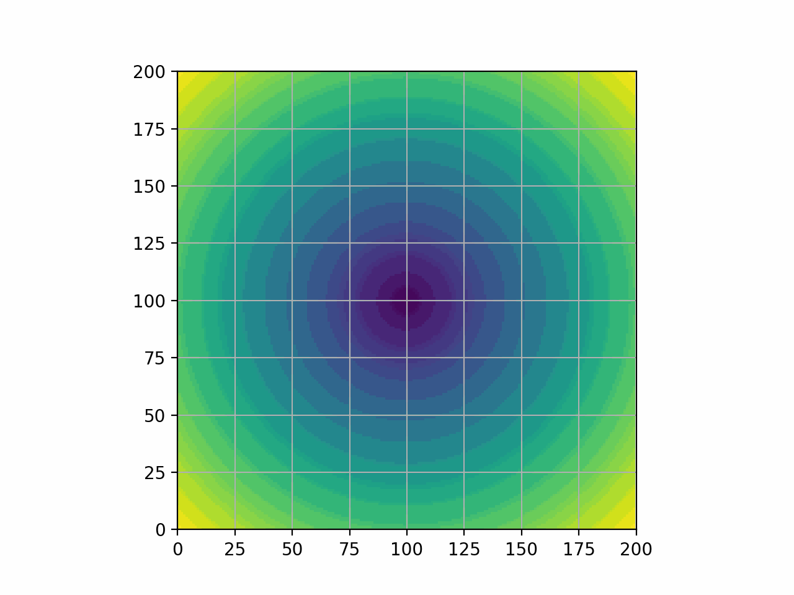
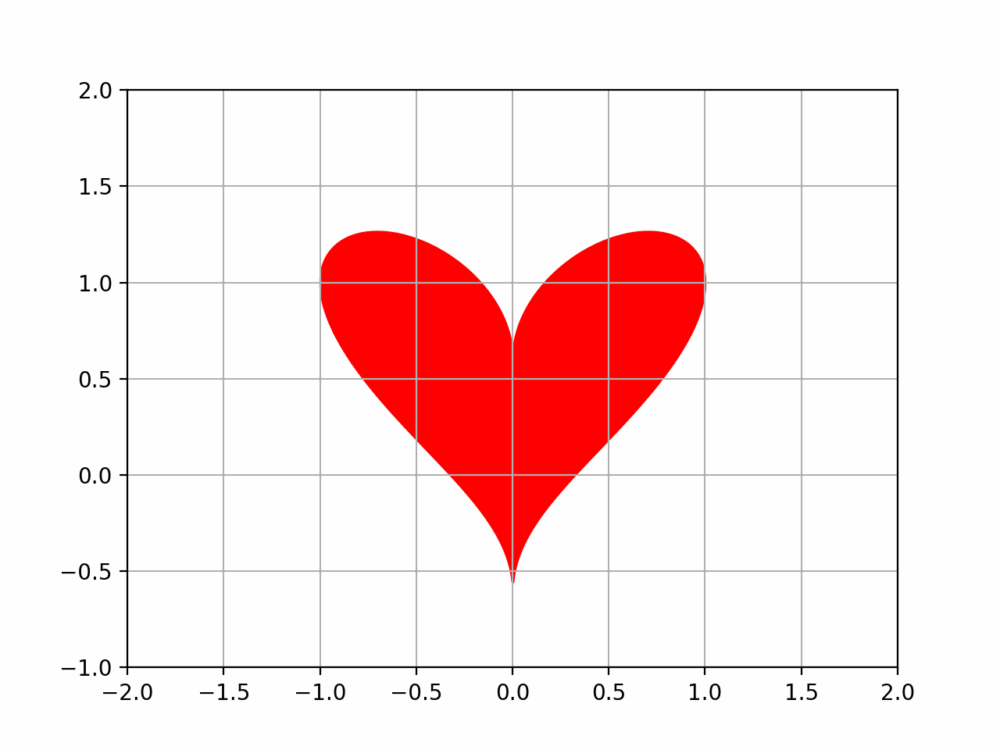

# Animaker
Pythonのmatplotlibを使って関数のgifアニメーションを作成できるモジュール

## 例

### ノーマルなプロット

- [ソースコード](example/sin_curve_animation.py)

### 重ね合わせのプロット

- [ソースコード](example/move_dot_animation.py)

### 色を塗るプロット

- [ソースコード](example/move_heart_animation.py)

### 動く画像のプロット

- [ソースコード](example/out/move_circle_animation.gif)
