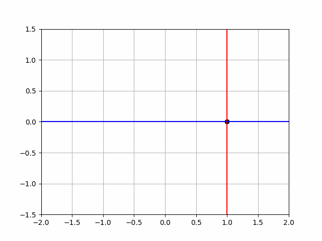

# Animaker
Pythonのmatplotlibを使って関数のgifアニメーションを作成できるモジュール

## 例

### ノーマルなプロット


- [ソースコード](example/sin_curve_animation.py)

### 重ね合わせのプロット


- [ソースコード](example/move_dot_animation.py)


### 色を塗るプロット


- [ソースコード](example/move_heart_animation.py)

### 動く画像のプロット


- [ソースコード](example/move_circle_animation.py)

## 使い方

### 1. リポジトリのクローン
```
git clone https://github.com/kentakom1213/Animaker.git
```

### 2. モジュールのインストール
```
pip install -r requirements.txt
```

グローバル環境にインストールするのが良くない場合は、venvなどの仮想環境を使いましょう。

### 3. コードの作成

[example](example/)のコードを参考に、好きなアニメーションを作ってみましょう。
（この辺りの詳しい方法はのちに整備します。）
