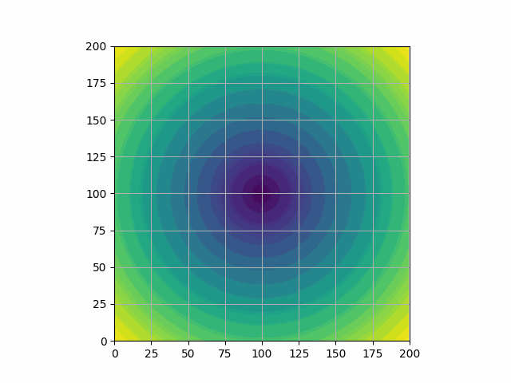

# Animaker
Pythonのmatplotlibを使って関数のgifアニメーションを作成できるモジュール

## 例

### ノーマルなプロット


$$
y := \sin x \sin 2\pi t \quad(-2\le x\le 2,\  0\le t\le 1)
$$

- [ソースコード](example/sin_curve_animation.py)

### 重ね合わせのプロット


$$
\begin{align}
	f&:\ x = \cos t\\
	g&:\ y = \sin t\\
	P&: (\cos t, \sin t) \quad (0\le t\le 2\pi)
\end{align}
$$

- [ソースコード](example/move_dot_animation.py)


### 色を塗るプロット


$$
\begin{align}
	f(x, t) &:= \sqrt{|x|} - \sqrt{1-|x|^2} \left( \frac{\sin\pi t}{4} + 0.6\right)\\
	g(x, t) &:= \sqrt{|x|} + \sqrt{1-|x|^2} \left( \frac{\sin\pi t}{4} + 0.6\right)\\
	& f(x, t) \le y \le g(x, t) \quad (-2\le x\le 2,\ 0\le t\le 1)
\end{align}
$$

- [ソースコード](example/move_heart_animation.py)

### 動く画像のプロット


$$
\begin{align}
	t' &:= 50\sin 2\pi t \\
	z &= \sqrt{x^2 + (y - t')^2}\\
	&(-100\le x\le 100,\ -100\le y\le 100,\ 0\le t\le 1)
\end{align}
$$

- [ソースコード](example/move_circle_animation.py)

## 使い方

### 1. リポジトリのクローン
```
git clone https://github.com/kentakom1213/Animaker.git
```

### 2. モジュールのインストール
```
pip install -r requirements.txt
```

グローバル環境にインストールするのが良くない場合は、venvなどの仮想環境を使いましょう。

### 3. コードの作成

[example](example/)のコードを参考に、好きなアニメーションを作ってみましょう。
（この辺りの詳しい方法はのちに整備します。）
